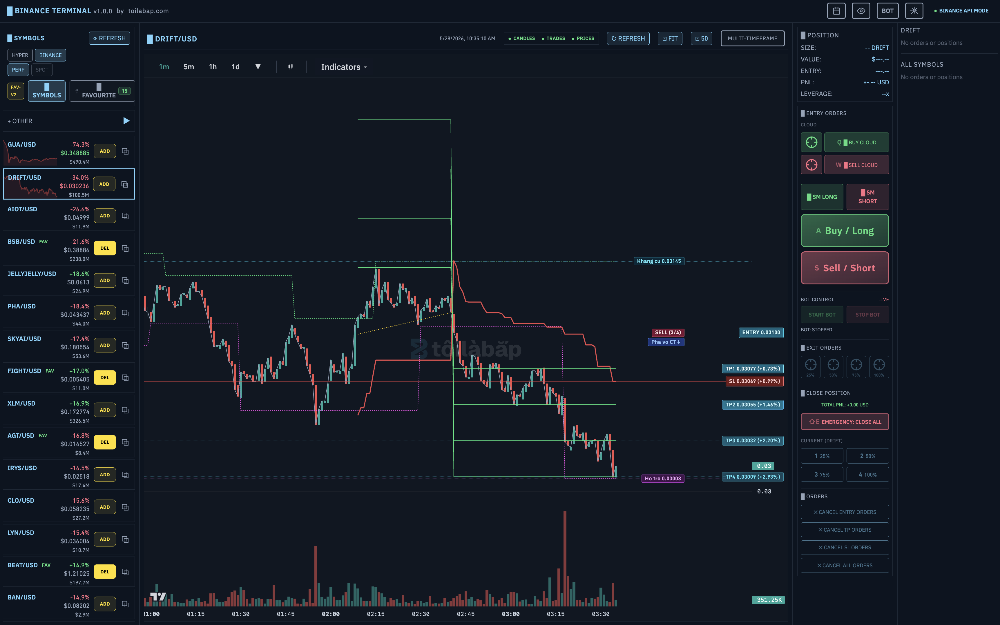

<p align="center">
  
</p>

<p align="center">
  
</p>

# Toilabap.com x Hyperscalper

Toilabap.com x Hyperscalper là nền tảng giao dịch thuật toán mã nguồn mở, giúp đội ngũ giao dịch và kỹ thuật triển khai chiến lược từ ý tưởng đến chạy thực tế nhanh, có cấu trúc và dễ mở rộng.

## Tổng Quan Dự Án

- Mục tiêu: rút ngắn thời gian từ nghiên cứu chiến lược đến đặt lệnh thực tế.
- Phạm vi: hỗ trợ giao dịch đa sàn, phân tích kỹ thuật thời gian thực và tự động hóa bot.
- Tư duy thiết kế: một nền tảng, nhiều loại tài sản, luồng vận hành thống nhất.

## Giá Trị Cốt Lõi

- Một mã nguồn, nhiều sàn giao dịch.
- Theo dõi dòng tiền lớn bằng bộ lọc kỹ thuật nhiều lớp.
- Xây dựng nhanh, kiểm thử nhanh, triển khai nhanh.
- Tách bạch rõ giữa dữ liệu, tín hiệu, quản trị rủi ro và thực thi lệnh.

## Kiến Trúc Nền Tảng

```text
LOGIC CHIẾN LƯỢC CỦA BẠN
  -> LỚP KHUNG TOILABAP (Kiểm thử, Mô phỏng, Chạy thực tế)
  -> LỚP TRỪU TƯỢNG SÀN GIAO DỊCH (Alpaca, Binance, OANDA, ...)
  -> LỚP TÀI SẢN (Cổ phiếu, Tiền mã hóa, Ngoại hối, Hợp đồng tương lai)
```

## Thành Phần Chính Của Hyperscalper

- Giao diện thời gian thực xây dựng bằng Next.js, React và TypeScript.
- Biểu đồ kỹ thuật dùng lightweight-charts để hiển thị nhanh và ổn định.
- Bộ quét thị trường, theo dõi nến và tín hiệu theo thời gian thực.
- Vòng đời bot gồm khởi chạy, giám sát, dừng an toàn và khôi phục trạng thái.
- Cơ chế triển khai bằng PM2 cho môi trường máy chủ riêng.

## Cách Chạy Nhanh

1. Cài đặt thư viện phụ thuộc

```bash
npm install
```

2. Chạy môi trường phát triển

```bash
npm run dev
```

3. Biên dịch cho môi trường phát hành

```bash
npm run build
```

4. Triển khai bằng PM2

```bash
npm run deploy:pm2
```

## Tài Liệu Quan Trọng

- Luồng giao dịch trí tuệ nhân tạo: AI_TRADING_LOGIC.md
- Bộ quét Trend Matrix Ritchi: RITCHI_TREND_SCANNER.md
- Bot giao dịch giai đoạn 1: docs/BotTrading-Binance-Phase1.md
- Cơ chế kích hoạt khối lượng thời gian thực: docs/REALTIME_VOLUME_TRIGGER_ENGINE.md
- Quy trình xử lý treo màn hình tải: docs/LOADING_FREEZE_RUNBOOK.md
- Bộ tài liệu định vị thương hiệu: REBRAND_PLAYBOOK.md
- Cẩm nang vận hành tổng: docs/toilabap.com/docs/TOILABAP_INSTRUCTIONS_MASTER_PLAYBOOK_v2.md

## Định Hướng Cho Thành Viên Mới

- Bắt đầu từ chiến lược cốt lõi và định nghĩa điều kiện vào lệnh, thoát lệnh.
- Kiểm thử lịch sử trước khi bật mô phỏng hoặc chạy thực tế.
- Luôn cấu hình quản trị rủi ro trước khi kích hoạt bot.
- Theo dõi nhật ký hệ thống và trạng thái kết nối sàn trong toàn bộ phiên giao dịch.

## Lưu Ý Rủi Ro

Giao dịch tài chính luôn có rủi ro. Kết quả kiểm thử trong quá khứ không bảo đảm kết quả trong tương lai.

## Liên Hệ Và Cộng Đồng

- Website: https://toilabap.com
- GitHub: https://github.com/Dinoxv/toilabap.com
- Telegram: https://t.me/Jbap1989
- Zalo: https://zalo.me/859295259
- Facebook: https://www.facebook.com/share/1EVjJuNhce/?mibextid=wwXIfr
- Email: mailto:ngoxuanhung17041989@gmail.com
